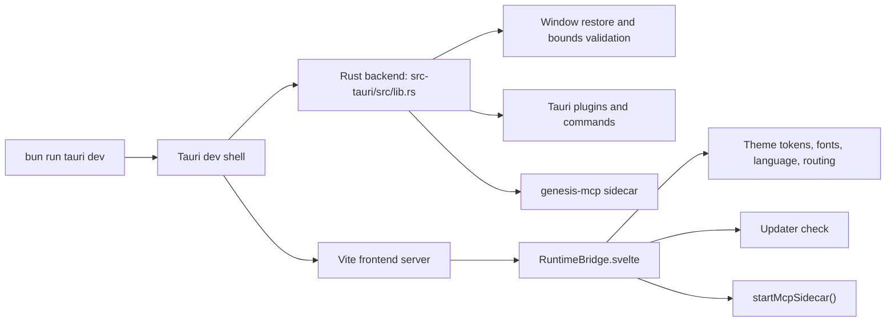

# Genesis Desktop v1 Technical Manual

_Current architecture reference for the Genesis Desktop app in this worktree._

This document describes how Genesis Desktop is assembled today: the Tauri 2 shell, the Svelte 5 frontend, the Rust backend, the MCP sidecar, the build tooling, and the window-management rules that keep the app usable on Windows.

## 1. What Genesis Desktop Is

Genesis Desktop is the local desktop shell for the Genesis product line. It is not a generic Electron clone. The app is intentionally split into:

- a Svelte 5 frontend that owns the visual shell, routing, theme state, and user interaction
- a Rust backend that owns window lifecycle, plugin registration, deep links, crash capture, and sidecar orchestration
- a separate Rust MCP sidecar binary that exposes the local tool surface
- Bun-driven frontend/package management, plus a tuned Rust dev profile for Windows

The current design goal is simple: the UI should boot fast, restore safely, and keep all OS-level window behavior inside the native layer where it belongs.

## 2. System Overview

The important boundary is that the webview owns the UI, but the Rust side owns anything that affects native window behavior or external process lifecycle.

## 3. Repository Map

| File                                                           | Role                                                                                       |
| -------------------------------------------------------------- | ------------------------------------------------------------------------------------------ |
| `apps/genesis-desktop/package.json`                            | Bun scripts and the frontend/runtime dependency graph                                      |
| `apps/genesis-desktop/src/app.css`                             | Shell-level layout, overflow rules, scroll containment, and resize-safe root styling       |
| `apps/genesis-desktop/src/lib/components/RuntimeBridge.svelte` | Bootstraps theme variables, language state, deep links, update checks, and the MCP sidecar |
| `apps/genesis-desktop/src/lib/components/WindowShell.svelte`   | Custom titlebar, window controls, and drag region                                          |
| `apps/genesis-desktop/src/lib/ai/mastra.config.ts`             | Declarative Mastra configuration used by the desktop app                                   |
| `apps/genesis-desktop/src/lib/ai/mcp-client.ts`                | Tauri invoke wrapper for the local MCP sidecar                                             |
| `apps/genesis-desktop/src-tauri/tauri.conf.json`               | Native window defaults, capabilities, and Tauri runtime config                             |
| `apps/genesis-desktop/src-tauri/Cargo.toml`                    | Rust crate graph, plugin dependencies, and dev/release profiles                            |
| `apps/genesis-desktop/src-tauri/src/lib.rs`                    | Main Tauri builder, plugin registration, panic bootstrap, and window setup                 |
| `apps/genesis-desktop/src-tauri/src/commands/mod.rs`           | Tauri commands and sidecar process management                                              |
| `apps/genesis-desktop/src-tauri/src/window_bounds.rs`          | Monitor-aware restore logic for off-screen protection                                      |
| `apps/genesis-desktop/src-tauri/src/mcp/mod.rs`                | Legacy custom stdio JSON-RPC bridge and message types                                      |
| `apps/genesis-desktop/src-tauri/src/bin/genesis-mcp.rs`        | Stand-alone MCP sidecar binary                                                             |

## 4. Frontend Architecture

The frontend is a Svelte 5 application running in a Tauri webview. The UI is structured around a shell that stays visually stable and lets the content area do the scrolling.

### 4.1 Boot sequence in the webview

`RuntimeBridge.svelte` is the key startup component. It:

- applies theme tokens to the root element
- toggles dark/light mode and color-scheme hints
- applies font family choices from the font store
- sets `lang` and `dir` for localization
- starts the updater check after first paint
- starts the MCP sidecar after the shell is visible
- listens for crash and deep-link events emitted by the Rust backend

This component is the bridge between the native shell and the client-side app state.

### 4.2 Theme and visual state

The theme system is injected into CSS variables on `document.documentElement`. That means the app can change theme without remounting the full tree. The design contract is:

- theme tokens are the source of truth
- body/root styling should not fight the window chrome
- scrollable content should live in the main pane, not on the full document root

### 4.3 Routing and app surface

The desktop shell uses the app router and page composition from the existing Genesis frontend stack. The desktop layer does not rewrite the product experience; it wraps it in a native window and adds desktop-specific behaviors:

- custom chrome
- update checks
- single-instance behavior
- deep-link handling
- MCP sidecar startup

## 5. Window Management

Window handling is the most sensitive part of the desktop app. The window must restore correctly, stay inside visible monitor bounds, and preserve resize handles on Windows.

### 5.1 Native window defaults

The current Tauri config is intentionally conservative:

- `title` is `Genesis`
- the window opens with logical size defaults
- minimum size is enforced
- `center: true` is used for first launch and invalid restore state
- `decorations: false` is used because the app uses custom chrome
- `shadow: true` is required on Windows
- `visible: false` is used so the restored window does not flash at the wrong position

The app should never hardcode `x` or `y` in config. Position belongs to the window-state restore flow.

### 5.2 Restore order

The restore flow is designed to prevent off-screen launches:

1. Tauri creates the window hidden
2. the window-state plugin restores size and position
3. the restore position is checked against current monitor bounds
4. if the restored rectangle is invalid or mostly off-screen, the window is centered
5. the window is shown only after validation

That order matters. Showing the window too early causes visible flashes and can reveal stale coordinates before the restore guard runs.

### 5.3 Monitor-aware bounds validation

`window_bounds.rs` exists because saved coordinates can become invalid when:

- the user disconnects a monitor
- the desktop layout changes
- the old saved position is negative
- the old saved position falls outside the available virtual desktop
- more than half the window is off any available display

This validation is the difference between a desktop app that “usually opens” and one that opens reliably on real Windows systems.

### 5.4 Custom titlebar and resize contract

The custom titlebar is not just visual chrome. It must preserve the native resize affordances at the window edges. The rules are:

- the drag region must stay within the titlebar strip only
- the root webview must not eat the edge hit zones
- the shell root should not use layout patterns that clip the resize corners
- window controls must not sit inside the drag region

The practical result is that the left, right, top, bottom, and corner resize handles remain functional even with `decorations: false`.

## 6. Rust Backend Architecture

The Rust side is a Tauri 2 application with a thin but important set of responsibilities.

### 6.1 Builder chain and plugins

`src-tauri/src/lib.rs` builds the app with plugins in a deliberate order. The backend currently wires in:

- window-state
- single-instance
- shell
- filesystem
- persisted scope
- notifications
- clipboard
- deep links
- updater
- debug logging

The app also installs a panic bootstrap so crashes are captured to a local log file instead of disappearing into the ether.

### 6.2 Commands

`src-tauri/src/commands/mod.rs` handles:

- starting the MCP sidecar
- sending requests to the sidecar
- consuming pending deep links
- emitting events back to the main window

The command layer is intentionally small. It should stay as a coordinator, not become a second frontend.

### 6.3 Crash and diagnostics path

Crash handling writes logs to the app data directory and emits a crash event to the webview when possible. That gives the UI enough information to show a useful crash surface rather than a blank failure.

The intended debug contract is:

- panic is captured early in bootstrap
- runtime panic hooks write durable logs
- the main window receives a crash event if the app is still alive enough to emit one

## 7. MCP Sidecar Architecture

Genesis Desktop uses a separate `genesis-mcp` binary for local tool transport. That keeps the main Tauri shell lean and prevents MCP process concerns from polluting the UI thread.

### 7.1 Sidecar role

The sidecar exists so local tools can be started on demand, isolated from the webview, and managed by Rust instead of browser JavaScript.

Current roles:

- start the sidecar only after the shell is visible
- keep the process lifetime under Rust control
- surface logs and termination failures back to the app

### 7.2 Current protocol direction

The desktop codebase has historically used a custom stdio JSON bridge for MCP-shaped traffic. The current worktree also moves the sidecar binary toward the official Rust MCP SDK (`rmcp`) so the app can test the real SDK path rather than a homegrown transport.

That is the correct direction for long-term stability because:

- the protocol shape becomes standard
- the Rust side no longer needs to fake the MCP semantics
- future tool expansion can be done with the real SDK instead of ad hoc JSON envelopes

### 7.3 Frontend bridge

`mcp-client.ts` is a thin Tauri invoke wrapper. It does not implement MCP itself; it asks Rust to manage the sidecar. That is the right layer separation.

## 8. Mastra Integration

Mastra is the app’s higher-level AI orchestration layer on the frontend/agent side.

### 8.1 Current package surface

The current worktree uses the official Mastra packages at the latest registry versions pulled in by Bun:

- `@mastra/core`
- `@mastra/memory`
- `@mastra/observability`
- `@mastra/pg`
- `@mastra/rag`
- `@mastra/mcp`

Those packages are the framework layer for agents, memory, telemetry, retrieval, and MCP-aware tooling.

### 8.2 Local config contract

`src/lib/ai/mastra.config.ts` is the declarative desktop-side configuration. It describes:

- the app identity
- the memory namespace
- the creative agent
- the tool schema the app expects to expose

The desktop app should treat this file as configuration, not as a second runtime.

### 8.3 Why Mastra matters here

Mastra gives Genesis Desktop a way to keep the creative agent and the local tool layer decoupled from the shell. That matters because the desktop app is not just a UI wrapper; it is a local workbench for AI-assisted creative workflows.

## 9. Build and Dev Workflow

The desktop app is intentionally Bun-first.

### 9.1 Package management

- Use Bun for JavaScript and TypeScript dependencies
- Do not use npm, npx, or yarn in this app
- Keep the package manager surface consistent with `packageManager: "bun@1.3.13"`

### 9.2 Scripts

The important scripts are:

- `bun run tauri dev` for the full desktop shell
- `bun run dev:frontend` for the Vite frontend alone
- `bun run type-check`
- `bun run test`
- `bun run build`
- `bun run release:windows`

### 9.3 Rust dev profile

The Rust side is tuned for local iteration, not production throughput:

- dev profile uses no LLVM optimization
- incremental compilation stays enabled
- codegen units stay low enough to keep Windows memory pressure manageable
- the dev script caps cargo job parallelism when needed

That combination keeps the backend from becoming the bottleneck in a thin Tauri shell.

### 9.4 Build hygiene

Do not casually delete the Rust target cache. Do not run `cargo clean` in normal development. The app depends on cached artifacts to keep incremental builds fast.

## 10. Capabilities and Security Model

Tauri 2 uses capabilities instead of the old Tauri 1 allowlist model. The desktop app should use capability files to grant only the permissions it needs.

Typical window-related permissions in this app include:

- start dragging
- close
- minimize
- toggle maximize
- set focus
- show
- query maximize state

The desktop app should keep these permissions explicit and local to the app shell.

## 11. Stability and Troubleshooting

When the desktop app misbehaves, the highest-value checks are:

- is the frontend dev server alive?
- did the Rust binary launch?
- is the window visible but off-screen?
- did the sidecar fail before startup?
- did the root shell accidentally capture the resize zones?
- did a stale monitor position get restored?

The most common failure classes seen so far are:

- recursive or wrong dev scripts
- stale window coordinates
- root overflow and pointer-event rules that break edge resizing
- missing Rust dev profile tuning
- sidecar protocol mismatch

## 12. Current Design Principles

This desktop app works best when the following rules are treated as architecture, not preference:

- Keep the shell boring and predictable.
- Keep scrolling inside the content pane, not the full document root.
- Keep window restore logic native and monitor-aware.
- Keep the titlebar drag region narrow and well-behaved.
- Keep the Rust backend thin.
- Keep AI orchestration in Mastra, not inside UI glue.
- Keep the sidecar as a real process boundary.
- Keep Bun as the JS package manager.

## 13. Files To Know First

If you need to orient quickly, read these first:

1. `apps/genesis-desktop/src-tauri/src/lib.rs`
2. `apps/genesis-desktop/src-tauri/src/commands/mod.rs`
3. `apps/genesis-desktop/src-tauri/src/window_bounds.rs`
4. `apps/genesis-desktop/src-tauri/src/bin/genesis-mcp.rs`
5. `apps/genesis-desktop/src/lib/components/RuntimeBridge.svelte`
6. `apps/genesis-desktop/src/lib/components/WindowShell.svelte`
7. `apps/genesis-desktop/src/lib/ai/mastra.config.ts`
8. `apps/genesis-desktop/src/lib/ai/mcp-client.ts`
9. `apps/genesis-desktop/src/app.css`
10. `apps/genesis-desktop/package.json`

## 14. Practical Summary

Genesis Desktop v1 is a native desktop shell wrapped around a Svelte app and a Rust control plane. The app is stable when the responsibilities stay separated:

- Svelte handles presentation and user flow
- Rust handles windowing, process orchestration, and native integration
- Mastra handles higher-level AI orchestration
- MCP handles local tool transport
- Bun handles frontend dependencies and scripts

That division is what makes the app maintainable. If any one layer starts doing another layer’s job, the shell becomes fragile very quickly.
