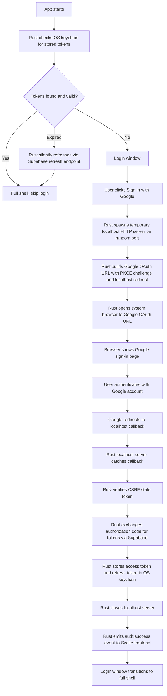

**⚠️ ABSOLUTE GIT SAFETY LAW ⚠️ — THE AGENT MUST NEVER RUN git reset, git stash, git checkout --, git clean -f, git restore, git revert, git rebase, git cherry-pick, git commit --amend, git push --force, OR ANY OTHER DESTRUCTIVE GIT OPERATION WITHOUT EXPLICIT CONSENT FROM THE OWNER. WORKING TREE CHANGES ARE PRECIOUS AND IRREPLACEABLE. THEY MUST NEVER BE STASHED, DISCARDED, REVERTED, RESET, OR OVERWRITTEN. ALWAYS ASK THE OWNER FIRST. NO EXCEPTIONS, EVER.**

# Genesis Desktop Auth Flow

## Notes

- Full shell is the default post-auth state.
- The login window is minimal and only exists until auth succeeds.
- The browser used for Google auth is the system default browser.
- Rust owns token storage, callback capture, and the security checks.
